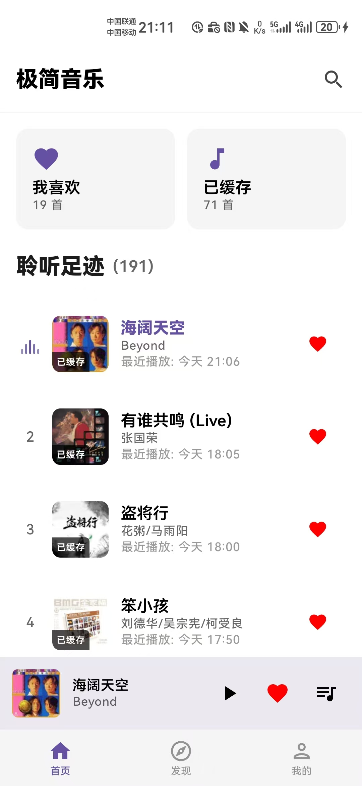
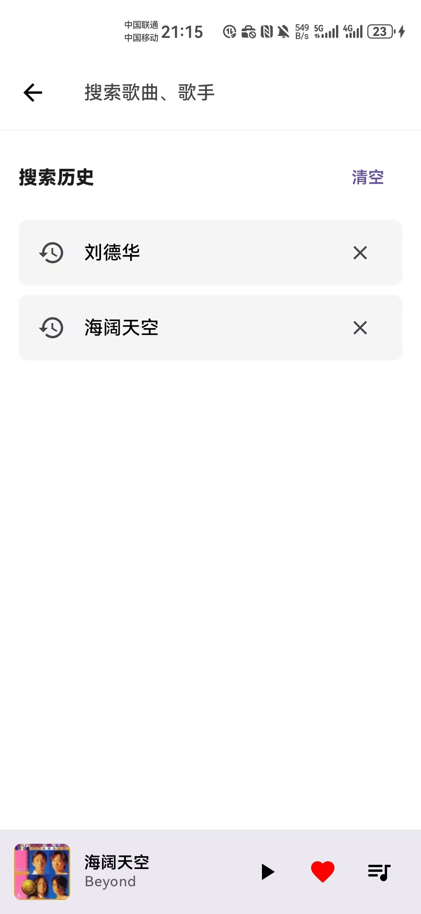
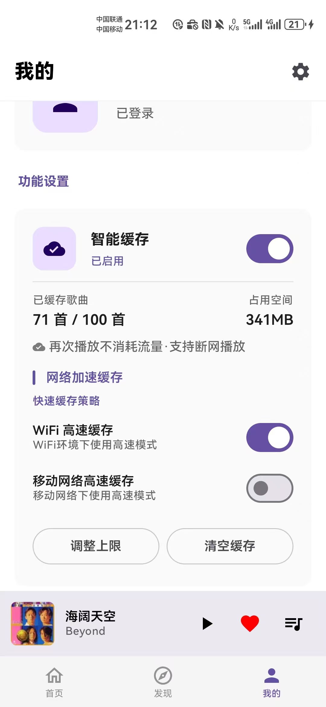
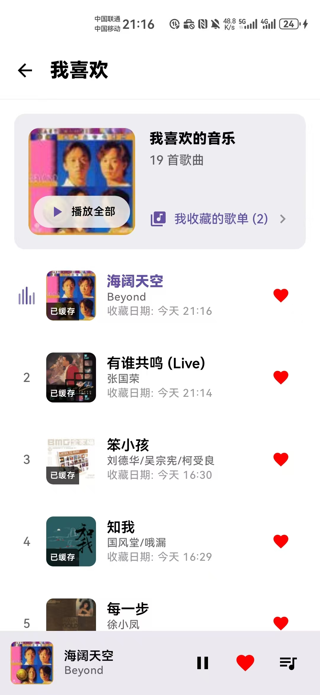
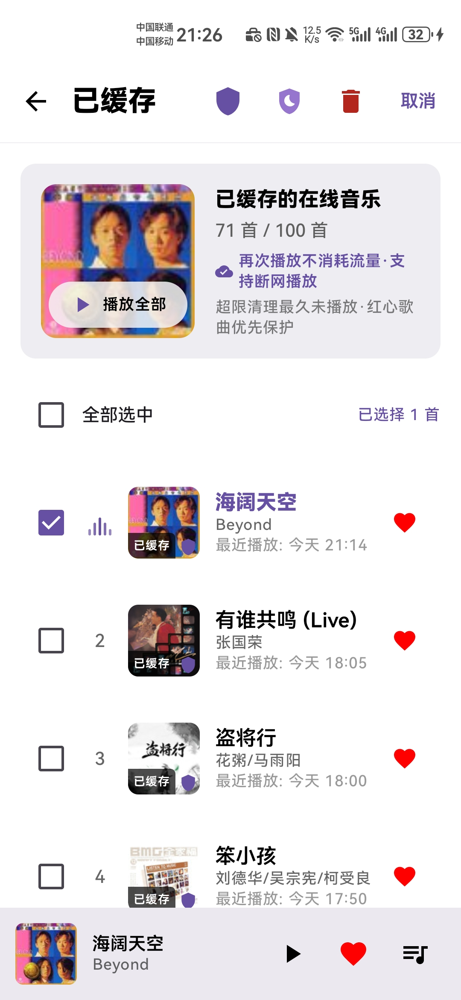

# 极简音乐

[](README.md)
[](LICENSE)
[](https://android-arsenal.com/api?level=26)
[](https://kotlinlang.org)
[](https://developer.android.com/compose)

一款基于 Kotlin + Jetpack Compose 的极简风格 Android 音乐播放器，定位为**个人技术研究项目**，旨在探索现代 Android 架构、媒体播放工程和性能优化的最佳实践。

> **注意**：本项目使用公开可访问的音乐 API 用于技术研究，**非商业用途**，仅供个人学习与技术交流。

## 应用截图

| 首页 | 发现 | 播放器 | 搜索 |
|------|------|--------|------|
|  |  |  |  |

| 我的 | 收藏 | 已缓存 |
|------|------|--------|
|  |  |  |

## 下载

[](https://github.com/dqh7ld9pzg-cell/minimalistmusic/releases/latest/download/minimalist-music-v1.2.19.apk)

> APK 通过 GitHub Releases 分发。不包含任何 API 密钥或凭证，自行构建时请配置自己的 API 信息。

## 演示视频

[观看演示](https://github.com/dqh7ld9pzg-cell/minimalistmusic/releases/latest/download/recordApp.mp4)

## 项目概述

极简音乐是一款功能完备的音乐播放器，在 Material Design 3 界面下整合了在线流媒体播放、本地音乐管理和智能缓存系统。项目围绕以下技术目标构建：

- **Clean Architecture** 在 Compose 项目中的大规模落地实践
- **Media3 ExoPlayer** 深度集成——自定义缓存策略、歌词同步
- **Kotlin StateFlow** 驱动的响应式状态管理，覆盖多页面导航图
- **性能工程**——启动优化、帧率监控、内存泄漏检测

## 功能特性

### 音乐播放
- 在线流媒体播放（通过公开音乐 API）
- 本地音乐扫描与播放
- 后台播放 + MediaSession 控制（通知栏 / 锁屏）
- 播放队列管理，支持拖拽排序
- 三种播放模式：顺序播放 / 随机播放 / 单曲循环
- 同步滚动歌词 + 拖拽定位

### 音乐发现
- 精选歌单与热门推荐
- 歌手搜索与详情页
- 全维度搜索（歌曲 / 歌手 / 歌单）

### 个人中心
- 用户账号系统 + 云端同步（收藏、播放历史）
- 收藏歌曲 / 歌单管理
- 分页播放历史浏览
- 已缓存歌曲管理 + 智能淘汰策略

### 性能特性
- 冷启动优化：Splash Screen API + Baseline Profile + 延迟初始化
- UI 帧率监控：`ChoreographerMonitor` 检测掉帧并自动捕获堆栈
- 内存监控：定时 GC 触发 + 堆内存趋势预警
- 网络感知缓存：Wi-Fi 环境下积极预加载，移动网络下保守策略

## 架构设计

项目遵循 **Clean Architecture** 严格分层。Domain 层零 Android 依赖，可完全单元测试。

```
┌──────────────────────────────────────────────────────────────────┐
│                      PRESENTATION 层                             │
│  ┌──────────┐  ┌──────────┐  ┌──────────┐  ┌──────────┐        │
│  │ HomeScreen│  │Discover  │  │Player    │  │Search    │  ...   │
│  │ (Compose) │  │Screen    │  │Screen    │  │Screen    │        │
│  └─────┬─────┘  └─────┬─────┘  └─────┬─────┘  └─────┬─────┘      │
│        │              │              │              │             │
│        └──────────────┴──────────────┴──────────────┘             │
│                          │  StateFlow                            │
│  ┌───────────────────────┴────────────────────────────────────┐  │
│  │                    ViewModel 层                            │  │
│  │  HomeVM  │  PlayerVM  │  DiscoverVM  │  ProfileVM  │ ...  │  │
│  │  AccountSyncVM  │  CachedMusicVM  │  LoginVM              │  │
│  └───────────────────────┬────────────────────────────────────┘  │
├──────────────────────────┼───────────────────────────────────────┤
│                     DOMAIN 层                                    │
│  ┌───────────────────────┴────────────────────────────────────┐  │
│  │  UseCase（业务用例）       Repository 接口（契约）          │  │
│  │  PlayNextSongUseCase         MusicOnlineRepository         │  │
│  │  ToggleFavoriteWithSync      MusicLocalRepository          │  │
│  │  LoadLyricsUseCase           SearchRepository              │  │
│  │  PreparePlaylistUseCase      PlaybackController            │  │
│  │  HandleUrlExpiredUseCase     UserRepository                │  │
│  │  SyncFavoritesToCloud        SearchHistoryRepository       │  │
│  │  SyncHistoryToCloud          CacheStateManager             │  │
│  └───────────────────────┬────────────────────────────────────┘  │
├──────────────────────────┼───────────────────────────────────────┤
│                      DATA 层                                     │
│  ┌───────────────┐  ┌──────────────┐  ┌──────────────────────┐  │
│  │ Remote        │  │ Local        │  │ Cache                │  │
│  │ Retrofit +    │  │ Room +       │  │ AudioCacheManager    │  │
│  │ OkHttp + Gson │  │ DataStore    │  │ ProtectedLruEvictor  │  │
│  │ DTO 映射      │  │ DAO + Entity │  │ CacheConfig          │  │
│  └───────┬───────┘  └──────┬───────┘  └──────────┬───────────┘  │
└──────────┼─────────────────┼─────────────────────┼──────────────┘
           │                 │                     │
           ▼                 ▼                     ▼
     公开音乐 API        SQLite / File       ExoPlayer LRU Cache
```

### 各层职责

| 层 | 职责 | 依赖 |
|----|------|------|
| **Presentation** | Compose UI、ViewModel 状态管理、页面导航 | Domain（UseCase, Model） |
| **Domain** | 业务逻辑、Repository 接口定义、缓存状态管理 | 无（纯 Kotlin） |
| **Data** | API 请求、数据库操作、文件缓存、DTO→Domain 映射 | Domain（实现 Repository 接口） |

### 状态管理

- **StateFlow** 作为每个 ViewModel 的单一数据源
- **Activity 级共享 ViewModel**（通过 Hilt）：跨页面复用，消除页面切换时的数据重复加载和 UI 闪烁
- 单向数据流：`UI 事件 → ViewModel → UseCase → Repository → StateFlow → UI`

## 技术栈

| 类别 | 技术 | 版本 | 用途 |
|------|------|------|------|
| **语言** | Kotlin | 2.0.21 | 100% Kotlin 代码 |
| **UI 框架** | Jetpack Compose (BOM) | 2024.09.00 | 声明式 UI + Material 3 |
| **设计系统** | Material Design 3 | 1.4.0 | 主题、组件、动态色彩 |
| **依赖注入** | Hilt (Dagger) | 2.48.1 | 编译期 DI |
| **导航** | Navigation Compose | 2.7.5 | 类型安全的声明式路由 |
| **HTTP 客户端** | Retrofit + OkHttp | 2.9.0 / 4.12.0 | REST API + 拦截器链 |
| **JSON** | Gson | 2.10.1 | 序列化/反序列化 |
| **数据库** | Room | 2.6.0 | 编译期 SQL 校验的本地持久化 |
| **KV 存储** | DataStore Preferences | 1.0.0 | 响应式偏好设置 |
| **媒体播放** | Media3 ExoPlayer | 1.2.0 | 音频解码、流媒体、缓存 |
| **媒体会话** | Media3 Session | 1.2.0 | 系统媒体控制与通知 |
| **图片加载** | Coil Compose | 2.5.0 | 异步加载 + 内存/磁盘缓存 |
| **系统 UI** | Accompanist | 0.32.0 | 状态栏沉浸、运行时权限 |
| **拖拽排序** | Reorderable | 2.4.0 | 播放列表拖拽重排 |
| **滚动条** | LazyColumnScrollbar | 2.2.0 | 快速滑动指示器 |
| **构建** | AGP / Gradle | 8.13.0 / 8.13 | 构建系统 |
| **性能** | Baseline Profile | 1.2.4 | AOT 编译加速启动 |

## 设计决策

| 决策 | 理由 |
|------|------|
| **Compose 替代 XML Views** | 声明式范式与 StateFlow 响应式模型天然适配；消除 Fragment/Adapter 模板代码；`Crossfade` 和 `animateDpAsState` 用极少量代码实现流畅过渡动画 |
| **Clean Architecture 三层分离** | Domain 层零 Android 依赖——可完全单元测试；Data 层可替换（如切换 API 提供商而不影响 UI 和业务逻辑） |
| **Hilt 替代 Koin** | 编译期 DI 图校验，构建时即可捕获配置错误；生成代码方式性能优于运行时反射 |
| **Activity 级共享 ViewModel** | 消除页面切换时的数据重复加载；解决 empty→data 状态的 UI 闪烁问题 |
| **ExoPlayer (Media3)** | 模块化管道架构支持自定义 `CacheEvictor`、自定义 `DataSource.Factory` 处理 URL 过期、精确 seek 控制实现歌词同步 |
| **按歌曲数量分级缓存** | 通过 `StatFs` 检测设备存储空间——高端设备（可用 ≥10GB）默认缓存 100 首，中低端默认 50 首；避免固定容量无法适应不同设备能力 |
| **收藏歌曲保护淘汰** | `ProtectedLruCacheEvictor` 继承 ExoPlayer 的 `CacheEvictor`，收藏歌曲白名单保护不被淘汰 |
| **动态缓存上限** | `CacheConfig.getDynamicMaxBytes()` 根据实际歌曲大小 + 100MB 缓冲动态调整，防止 ExoPlayer 缓存碎片导致无限增长 |
| **自定义性能监控** | `ChoreographerMonitor` 挂载帧回调检测卡顿；`MemoryPerformanceMonitor` 后台触发 GC 追踪堆内存趋势；所有数据通过 `PerformanceReporter` 结构化输出 |
| **网易云 API 集成** | 逆向分析 API 协议，自定义请求头签名（`NeteaseHeaderInterceptor`）+ 错误处理拦截器实现优雅降级 |

## 项目结构

```
app/src/main/kotlin/com/minimalistmusic/
├── presentation/               # Presentation 层
│   ├── ui/
│   │   ├── screens/            # 页面级 Composable（首页、发现、播放器等）
│   │   ├── components/         # 可复用组件（MiniPlayer、FavoriteButton 等）
│   │   └── theme/              # Material 3 主题、色彩、字体
│   ├── viewmodel/              # ViewModel + StateFlow 状态管理
│   ├── error/                  # 全局错误通道与处理器
│   └── Navigation.kt           # NavHost、底部导航栏、MiniPlayer 编排
│
├── domain/                     # Domain 层（零 Android 依赖）
│   ├── model/                  # 领域模型（PlayData, PagedData, CacheProgress, PlayMode）
│   ├── repository/             # Repository 接口（契约定义）
│   ├── usecase/                 # 业务用例
│   │   ├── player/             # PlayNextSong, LoadLyrics, PreparePlaylist, HandleUrlExpired
│   │   ├── favorite/           # ToggleFavoriteWithSync, SyncFavoritesToCloud
│   │   └── history/            # GetPagedPlayHistory, SyncHistoryToCloud
│   └── cache/                  # CacheStateManager
│
├── data/                       # Data 层
│   ├── remote/                 # Retrofit API Service、DTO、拦截器
│   ├── local/                  # Room 数据库、DAO、Entity、DataStore 偏好
│   ├── cache/                  # AudioCacheManager, CacheConfig, ProtectedLruCacheEvictor
│   ├── repository/             # Repository 接口实现
│   └── mapper/                 # Entity/DTO → Domain Model 映射
│
├── service/                    # 前台 Service
│   └── MusicService.kt         # MediaSession + ExoPlayer 生命周期管理
│
├── performance/                # 自定义性能监控体系
│   ├── monitor/                # Choreographer、Memory、UI、Startup 监控器
│   ├── reporter/               # PerformanceReporter, PerformanceStorage
│   ├── metric/                 # PerformanceMetric 数据类
│   └── config/                 # PerformanceConfig 阈值配置
│
├── di/                         # Hilt 依赖注入模块
│   ├── AppModule.kt
│   ├── RepositoryModule.kt
│   └── MonitoringModule.kt
│
└── util/                       # 共享工具类（LogConfig 等）
```

## 构建运行

### 环境要求

| 要求 | 版本 |
|------|------|
| Android Studio | Ladybug (2024.2.1) 或更高版本 |
| JDK | 17 |
| Kotlin | 2.0.21 |
| Gradle | 8.13 |
| Android SDK (compileSdk) | 35 |
| Android SDK (minSdk) | 26 (Android 8.0) |
| Android SDK (targetSdk) | 35 (Android 15) |

### 构建步骤

```bash
# 1. 克隆项目
git clone https://github.com/dqh7ld9pzg-cell/minimalistmusic.git
cd minimalistmusic

# 2. 同步依赖
./gradlew build

# 3. 安装 Debug 版本到已连接设备
./gradlew installDebug
```

### 构建变体

| 变体 | 命令 | 说明 |
|------|------|------|
| **Debug** | `./gradlew assembleDebug` | 开发调试版本，包含日志和性能监控 |
| **Release** | `./gradlew assembleRelease` | ProGuard 混淆优化，适用于分发 |

### API 配置

本应用依赖公开可访问的音乐 API。配置自有 API 凭证的步骤：

1. 打开 `app/build.gradle.kts`
2. 找到 `defaultConfig` 下的 `buildConfigField` 配置项
3. 替换占位符为自有值：
   ```groovy
   buildConfigField("String", "NETEASE_API_BASE_URL", "\"your-api-url\"")
   buildConfigField("String", "API_KEY", "\"your-api-key\"")
   ```

> **本仓库不包含任何 API 密钥。**

## 性能体系

### 启动优化
- **Splash Screen API**（`core-splashscreen:1.0.1`）实现即时品牌展示
- **Baseline Profile**（1.2.4）对关键启动路径进行 AOT 编译
- 非关键组件延迟初始化（性能监控、同步服务）
- 目标：基准设备冷启动 < 800ms

### 运行时监控
- **ChoreographerMonitor**：挂载 `Choreographer.FrameCallback` 检测掉帧；超过阈值自动捕获堆栈定位卡顿原因
- **MemoryPerformanceMonitor**：App 退后台时触发 GC 并记录堆内存趋势；内存分配超阈值预警
- **UIPerformanceMonitor**：统计 Compose 重组次数，标记过度重组

### 缓存策略

采用**设备分级、按歌曲数量**的缓存策略，而非固定容量上限：

| 设备级别 | 可用存储 | 默认缓存 | 最大缓存 |
|---------|---------|---------|---------|
| 高端设备 | ≥ 10 GB | 100 首 | 200 首 |
| 中低端设备 | < 10 GB | 50 首 | 100 首 |

- 应用启动时通过 `StatFs` 自动检测设备存储空间
- 每首歌曲按 ~8 MB 估算，叠加 1.5× 冗余系数（`歌曲数 × 8 × 1.5` MB）
- `ProtectedLruCacheEvictor` 保护收藏歌曲不被淘汰
- `CacheConfig.getDynamicMaxBytes()` 根据实际缓存大小动态调整上限，防止 ExoPlayer 缓存碎片导致的无限增长
- 网络感知：Wi-Fi 下积极预加载，移动网络下保守策略

## 贡献指南

欢迎贡献代码，请遵循以下流程：

1. Fork 本仓库
2. 创建特性分支（`git checkout -b feature/AmazingFeature`）
3. 提交变更（`git commit -m 'Add some AmazingFeature'`）
4. 推送分支（`git push origin feature/AmazingFeature`）
5. 发起 Pull Request

## 免责声明

本项目仅供**个人学习与技术研究**用途。

- 音乐数据来源于公开可访问的 API，**未**通过官方合作或商业授权渠道获取
- 本仓库**不包含**任何官方 API 密钥、Token 或凭证——使用者需自行配置
- 本项目为**非商业**项目——请勿用于任何商业目的或发行
- 所有音乐内容的权利归属各自版权持有人

如您是版权持有人并有相关疑虑，请[提交 Issue](https://github.com/dqh7ld9pzg-cell/minimalistmusic/issues)。

## 开源协议

```
Copyright (C) 2025 JG.Y

Licensed under the Apache License, Version 2.0 (the "License");
you may not use this file except in compliance with the License.
You may obtain a copy of the License at

     http://www.apache.org/licenses/LICENSE-2.0

Unless required by applicable law or agreed to in writing, software
distributed under the License is distributed on an "AS IS" BASIS,
WITHOUT WARRANTIES OR CONDITIONS OF ANY KIND, either express or implied.
See the License for the specific language governing permissions and
limitations under the License.
```

完整协议文本请查看 [LICENSE](LICENSE) 文件。

---

**以 Kotlin、Compose 和对细节的关注构建。**
